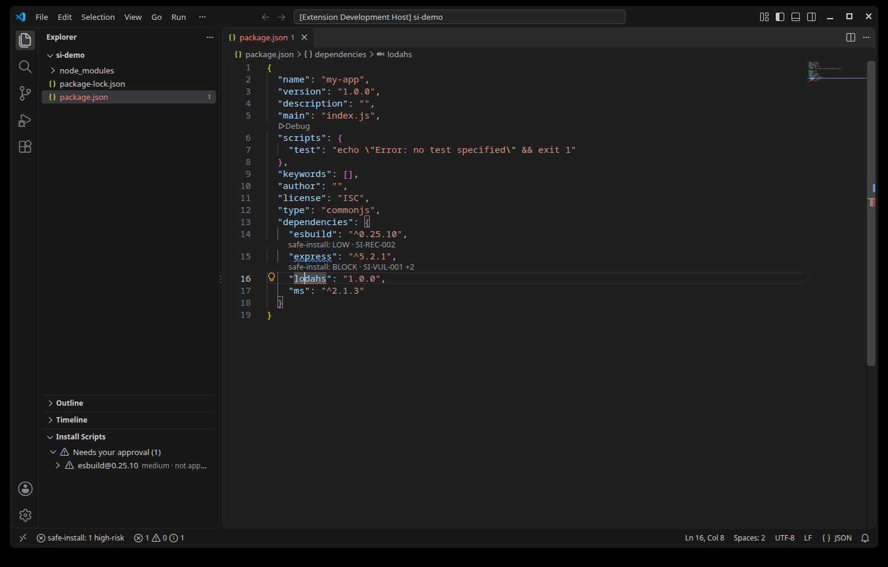
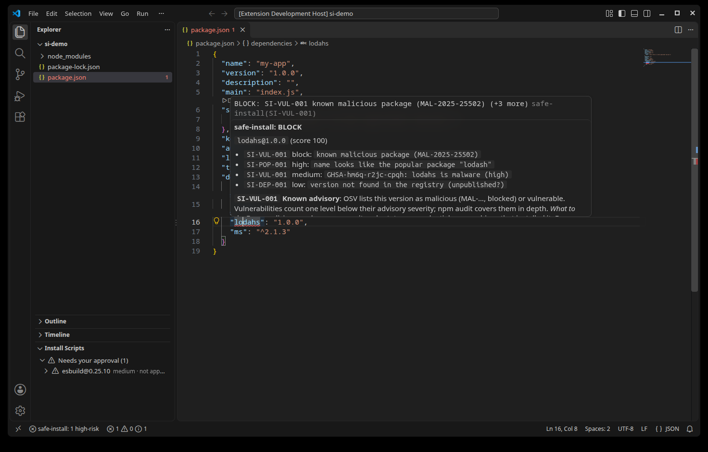

# safe-install for VS Code

See the supply-chain risk of your npm, pnpm, Yarn and bun dependencies where you edit them,
and approve install scripts yourself.

This extension is a front end for the [safe-install](https://github.com/crossben/safe-install)
command-line tool. Every check is done by the CLI you have installed; the extension only
displays the results. Works in VS Code, Cursor, Windsurf and VSCodium.



## What it does

- **Marks risky dependencies in `package.json`**: malware from the OSV database, typosquats,
  fresh or suspicious releases, integrity problems, packages blocked by your policy. Each one
  appears in the Problems panel, with a CodeLens showing its level.
- **Explains each finding** on hover: the evidence, and what the rule means and what to do.
  Risky packages pulled in by a dependency are shown on that dependency, with the chain.
- **Re-checks on save** of `package.json` or the lockfile.
- **Install Scripts view** (Explorer): the installed packages that want to run `preinstall`,
  `install` or `postinstall`, and whether you approved them.
- **Approve…** shows exactly what would run, then runs `safe-install approve` in a terminal
  you can see. High-risk scripts are never approved from the editor.
- **Quick fixes**: "Why is this package here?" and "Explain rule".
- **Copy Agent Instructions** for Claude Code, Codex, Cursor and other coding agents.



## Requirements

The safe-install CLI, version 0.2.3 or later:

```sh
# macOS / Linux (Homebrew)
brew tap crossben/safe-install https://github.com/crossben/safe-install
brew install --cask safe-install

# Windows (Scoop)
scoop bucket add safe-install https://github.com/crossben/safe-install
scoop install safe-install
```

Linux packages (.deb, .rpm, .apk) are on the
[releases page](https://github.com/crossben/safe-install/releases/latest). Install your
dependencies with `safe-install` instead of `npm install` so no install script runs on its
own; the extension then shows what is waiting for you.

## Settings

| Setting | Default | |
|---|---|---|
| `safeInstall.path` | `""` | Path to the CLI; empty uses your `PATH`. **User settings only.** |
| `safeInstall.checkOnSave` | `true` | Check again when `package.json` or a lockfile is saved. |
| `safeInstall.minSeverity` | `low` | Lowest level marked in `package.json`. |
| `safeInstall.diffBase` | `""` | Only flag packages new or changed since a git ref, e.g. `origin/main`. |
| `safeInstall.codeLens` | `true` | Show the level above each risky dependency. |
| `safeInstall.timeoutSeconds` | `60` | Longest a single CLI command may run. |

Policy (minimum release age, approvals, blocked packages) lives in `.safe-install.json`,
owned by the CLI; the extension never writes it.

## Security

A repository you open must not be able to use this extension against you:

- `safeInstall.path` can only be set in your user settings, never by a workspace.
- In Restricted Mode (untrusted folders) the extension runs nothing.
- The CLI is started directly, never through a shell, with a timeout and an output limit.
  Package names can never be passed as flags.
- Text that comes from packages is shown as plain text or code: it cannot add links,
  commands or HTML to hovers.
- The extension makes no network requests and has no telemetry. It ships as a single
  bundled file with no dependencies.

Found a problem? See [SECURITY.md](https://github.com/crossben/safe-install/security/policy).

## Develop

```sh
npm ci --ignore-scripts   # nothing here needs install scripts
npm run build             # dist/extension.js
npm run lint
npm run typecheck
npm test                  # unit tests, then VS Code integration tests
npm run package           # safe-install-<version>.vsix
```

## License

Apache-2.0
